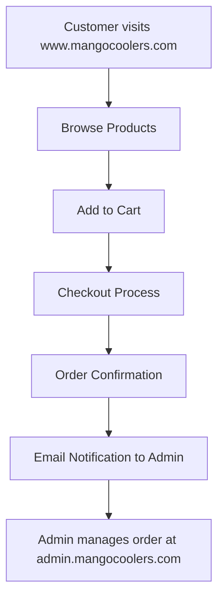
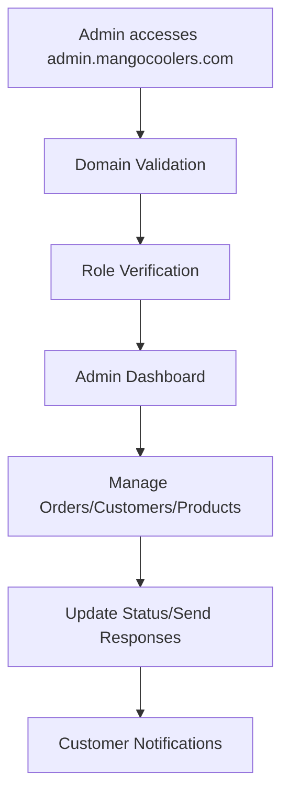

# 🏗️ Professional Subdomain Architecture
## Mango Appliances E-Commerce Platform

## 🌐 Architecture Overview

This project implements a professional e-commerce platform with a separated admin dashboard using subdomain architecture:

```
┌─────────────────────────────────────────────────────────────┐
│                    DOMAIN ARCHITECTURE                      │
├─────────────────────────────────────────────────────────────┤
│                                                             │
│  🌍 www.mangocoolers.com        🛡️ admin.mangocoolers.com   │
│  ┌─────────────────────────┐   ┌─────────────────────────┐   │
│  │   CUSTOMER FRONTEND     │   │    ADMIN DASHBOARD      │   │
│  │                         │   │                         │   │
│  │ • Product Catalog       │   │ • Order Management      │   │
│  │ • Shopping Cart         │   │ • Customer Management   │   │
│  │ • Checkout System       │   │ • Product CRUD          │   │
│  │ • User Authentication   │   │ • Analytics Dashboard   │   │
│  │ • Warranty Registration │   │ • Email Notifications   │   │
│  │ • Complaint System      │   │ • System Settings       │   │
│  │ • Order Tracking        │   │ • Security Features     │   │
│  └─────────────────────────┘   └─────────────────────────┘   │
│              │                             │                 │
│              └─────────────┐ ┌─────────────┘                 │
│                            │ │                               │
│  ┌─────────────────────────▼─▼─────────────────────────┐     │
│  │            SHARED SUPABASE BACKEND                  │     │
│  │                                                     │     │
│  │ • PostgreSQL Database                              │     │
│  │ • Row-Level Security (RLS)                         │     │
│  │ • Edge Functions                                   │     │
│  │ • Real-time Subscriptions                          │     │
│  │ • File Storage                                     │     │
│  │ • Email Service Integration                        │     │
│  └─────────────────────────────────────────────────────┘     │
└─────────────────────────────────────────────────────────────┘
```

## 🔐 Security Model

### Domain-Based Access Control
- **Customer Routes**: Only accessible from `www.mangocoolers.com`
- **Admin Routes**: Only accessible from `admin.mangocoolers.com`
- **Automatic Redirection**: Wrong domain access automatically redirects to correct subdomain

### Role-Based Authorization
```sql
-- User Roles Table
CREATE TABLE user_roles (
  id UUID PRIMARY KEY DEFAULT gen_random_uuid(),
  user_id UUID REFERENCES auth.users(id),
  role app_role NOT NULL, -- 'admin' | 'customer'
  UNIQUE(user_id, role)
);

-- Security Function
CREATE FUNCTION has_role(user_id UUID, role app_role) 
RETURNS BOOLEAN SECURITY DEFINER;
```

### Row-Level Security (RLS)
All database tables protected with RLS policies:
- **Admin-only data**: Orders, customers, products, complaints
- **User-specific data**: User profiles, addresses, wishlists
- **Public data**: Product catalog (read-only)

## 🛠️ Technical Implementation

### Frontend Architecture
```
src/
├── components/
│   ├── auth/
│   │   ├── AdminRoute.tsx          # Admin role verification
│   │   ├── DomainBasedRoute.tsx    # Subdomain access control
│   │   └── ProtectedRoute.tsx      # User authentication
│   ├── layout/
│   │   ├── AdminLayout.tsx         # Admin dashboard layout
│   │   ├── AdminHeader.tsx         # Admin navigation
│   │   └── Layout.tsx              # Customer site layout
│   └── admin/
│       ├── AdminStats.tsx          # Dashboard statistics
│       ├── AdminCharts.tsx         # Analytics charts
│       └── RecentActivity.tsx      # Activity feed
├── utils/
│   └── domainUtils.ts              # Domain detection utilities
└── pages/
    ├── AdminDashboard.tsx          # Main admin interface
    └── [customer-pages]            # Customer-facing pages
```

### Backend Architecture
```
supabase/
├── functions/
│   ├── send-admin-order-notification/     # Order alerts
│   ├── send-complaint-confirmation/       # Complaint alerts
│   └── send-warranty-notification/        # Warranty alerts
└── migrations/
    ├── [schema-migrations]                 # Database structure
    └── [security-policies]                 # RLS policies
```

## 🔄 Data Flow

### Customer Journey


### Admin Workflow


## 📧 Email Notification System

### Automated Admin Alerts
- **New Order**: Complete order details with customer information
- **New Complaint**: Instant notification with complaint details
- **New Warranty**: Registration details and approval workflow
- **System Events**: Critical system activity monitoring

### Professional Email Templates
- HTML formatted emails with branding
- Structured data presentation
- Action buttons for admin dashboard
- Mobile-responsive design

## 🚀 Development & Deployment

### Local Development
```bash
# Customer site (default)
http://localhost:5173/

# Admin dashboard
http://localhost:5173/?admin=true
```

### Production Domains
```bash
# Customer site
https://www.mangocoolers.com

# Admin dashboard  
https://admin.mangocoolers.com
```

### Environment Configuration
- **Single Codebase**: Both frontends in one repository
- **Shared Backend**: Single Supabase project
- **Domain Detection**: Runtime subdomain identification
- **Automatic SSL**: Lovable handles certificates

## 🛡️ Security Features

### Admin Dashboard Security
- ✅ **Subdomain Isolation**: Admin only accessible from admin subdomain
- ✅ **Role Verification**: Database-level admin role checking
- ✅ **Session Security**: Secure authentication with timeouts
- ✅ **CSRF Protection**: Built-in request validation
- ✅ **Input Sanitization**: Comprehensive data validation

### API Security
- ✅ **RLS Policies**: Row-level security on all tables
- ✅ **Admin Endpoints**: Protected edge functions
- ✅ **Rate Limiting**: Built-in request throttling
- ✅ **CORS Configuration**: Proper cross-origin handling

## 📊 Admin Dashboard Features

### 📈 Analytics & Reporting
- Real-time sales statistics
- Customer behavior analytics
- Order trend analysis
- Revenue tracking charts
- Export functionality (CSV)

### 📦 Order Management
- Complete order lifecycle management
- Status updates (Pending → Shipped → Delivered)
- Customer communication
- Shipping integration
- Bulk operations

### 👥 Customer Management
- Customer database with full profiles
- Order history and analytics
- Account management (block/unblock)
- Communication tools
- Support ticketing

### 🛍️ Product Management
- Full CRUD operations
- Image management system
- Inventory tracking
- Category management
- Bulk import/export

### ⚠️ Complaint System
- Complaint ticket management
- Priority-based routing
- Response tracking
- Customer communication
- Resolution analytics

### 🛡️ Warranty Management
- Registration approval workflow
- Serial number validation
- Warranty period tracking
- Status management
- Automated notifications

## 🎯 Benefits of This Architecture

### 🔒 **Enhanced Security**
- Complete separation of admin and customer interfaces
- Subdomain-based access control
- Role-based authorization at multiple levels

### 🚀 **Improved Performance**
- Independent scaling capabilities
- Reduced customer site complexity
- Optimized admin interface for management tasks

### 👥 **Better User Experience**
- Clean separation of concerns
- Professional admin interface
- No interference between customer and admin functions

### 🛠️ **Maintainability**
- Clear code organization
- Separate deployment strategies possible
- Independent feature development

### 📈 **Scalability**
- Easy to add new admin features
- Customer site remains lightweight
- Flexible infrastructure options

---

**This architecture provides a professional, secure, and scalable foundation for the Mango Appliances e-commerce platform with complete separation between customer and administrative functions.**